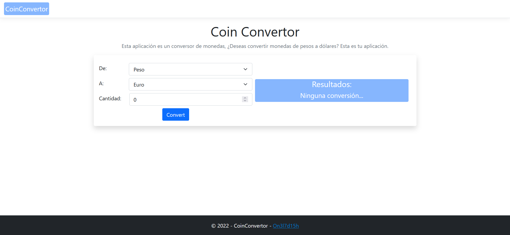
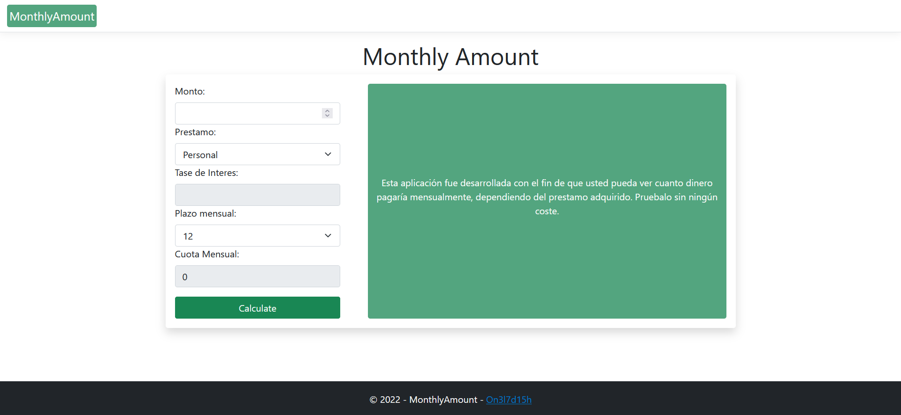

# ASP.NET CORE - Start (Bilingual)

😀¡Hola!😀

Por aquí les dejo, 3 nuevos proyectos desarrollado con la tecnología de ASP.NET CORE, se trata de 3 desarrollos sencillos para ir aprendiendo esta tecnología. ⭐Espero que lo disfruten.⭐


😀Greetings!😀

I bring us three new project developed with the ASP.NET CORE tecnology, are three simple projects that i do to start learning about this technology, ⭐so i hope you enjoy it⭐


---

## 📽🚀Proyectos / Proyects🚀📽


## 👹🏮ZodiacalSign - Signo del Zodiaco🏮👹


### ¿Qué es? / What is?

> Se trata de una página que te permite, en base a los datos suministrados, decirte cual es tu signo del zodiaco... ❓Me pregunto cuál serás.❓
> 
> 
> 
> It's a website you can use, inserting data or filling the fields, Which Zodiacal sign you are, ❓I wonder which sign you are...❓

---

## 💰💸CoinConvertor - Convertidor de Monedas💸💰




### ¿Qué es? / What is?

> Se trata de una página que te permite, hacer conversiones de monedas, los tipos disponibles de este simple desarrollo, 🤑son pesos, dolares y euros.🤑
> 
> 
> 
> It's a website you can use, to make coin convertions, the simple project has three kind of coin that you can convert, 🤑Peso, Dollar and Euro.🤑


---

## ⏲💸MonthlyAmount - Monto Mensual💸⏲




### ¿Qué es? / What is?

> Se trata de una página que te permite, saber cuanto debes pagar, en base a los datos suministrados. Así sabras cuanto debes pagar mensualmente, 😊Muchas gracias.😊
> 
> 
> 
> It's a website you can use, to know how you need to pay, filling the fields, At this way, you'll have a knowledge of your monthly amount, 😊Thank you very much.😊

---

### Tecnologías usadas:

Las tecnologías usadas en este proyecto, y que lo hicieron posible son:

```csharp
string[] tecnologías = {"ASP.NET CORE", "Razor Pages", "Bootstrap"}
```

### Used Technologies:

Here, i put the technologes that i used to bring to live this project:

```js
const tecnologies = ["ASP.NET CORE", "Razor Pages", "Bootstrap"]
```

---

### 👣Pie de documentación:👣


🌟✨Desarrollado por On3l7d15h. ✨🌟

### Documentation footer:

🌟✨Developed By On3l7d15h.✨🌟
